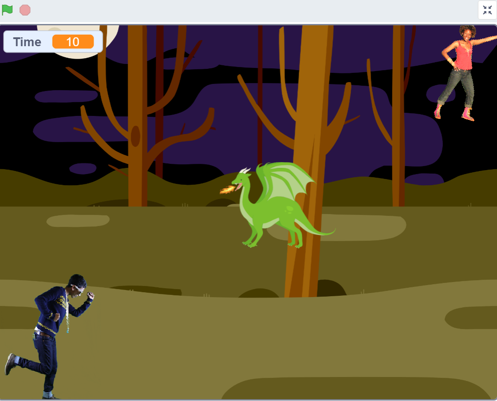
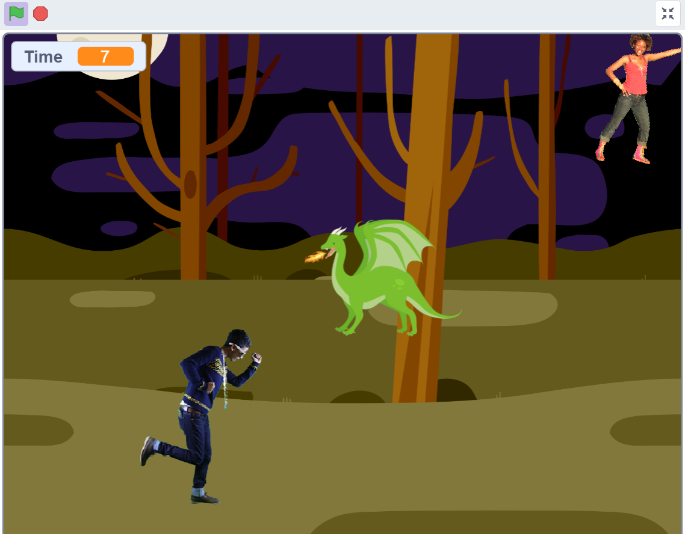
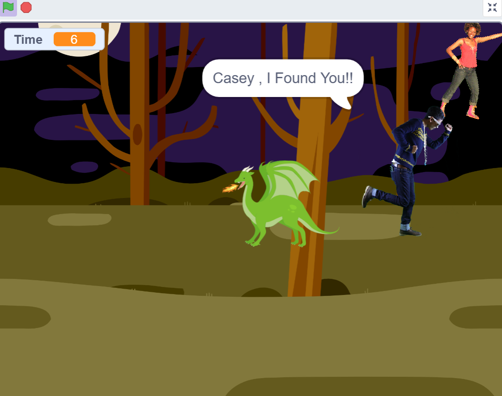
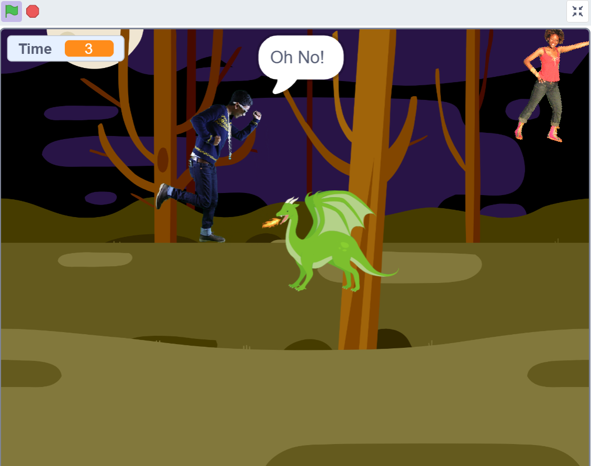
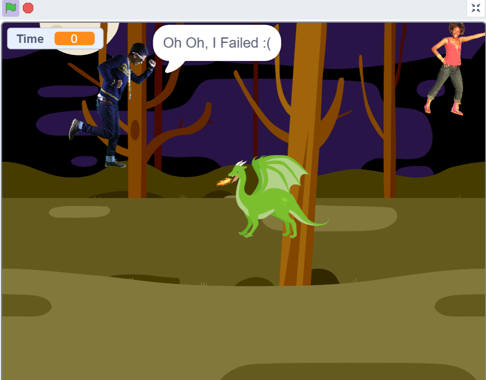

# Casey Quest

Created for CS50 Problem Set 0.

## Project Overview

Casey Quest is a simple Scratch game where the player controls Champ and must reach Casey before the timer runs out while avoiding the Dragon.

## Objective

Control Champ using the arrow keys.

Reach Casey before the timer runs out while avoiding the Dragon.

## Controls

- Up Arrow = Move Up
- Down Arrow = Move Down
- Left Arrow = Move Left
- Right Arrow = Move Right

## Win Condition

Touch Casey before the timer reaches zero.

## Lose Conditions

- Touch the Dragon
- Timer reaches zero

## Concepts Used

- Variables
- Events
- Loops
- Conditionals
- Custom Blocks
- Collision Detection

## What I Learned

This was my first programming project.

I learned how game logic is built using variables, loops, conditionals, events, collision detection, and custom blocks.

I also learned that having an idea is different from implementing it. Breaking a problem into smaller steps makes building much easier.

## Project Link

https://scratch.mit.edu/projects/1327264549

## Screenshots

### Game Introduction

### Gameplay

### Winning Screen

### Dragon Collision

### Time Out Screen

## Credits

Sprites from the Scratch library.

All code assembled and customized by me while completing CS50 Week 0.